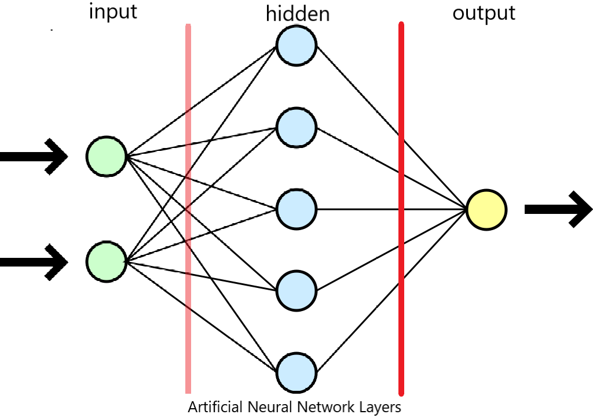

# Beginner's Guide to Machine Learning

*Machine Learning* can be overwhelming for beginners. The are complicated algorithms, complex mathematical equations, different tools available, and not so well-documented examples to deal with. This is a very steep learning, indeed. So, instead of starting from the bottom and climb, let's start from top and slide down. To do that, we need to answer these four key questions.

1. What machine learning backend to use instead of developing my own algorithm from scratch?
2. What programming language that is best suited to machine learning?
3. What high-level Application Programming Interface(API) to use?
4. What Integrated Development Environment(IDE) to code with?

After a thorough research, the following will be used:

1. Backend = [TensorFlow](https://www.tensorflow.org). It is an open source platform with all the necessary algorithm implemented. It is backed by Google and has a very active community support.
2. Programming Language = [Python](https://www.python.org). Somewhat like a de facto choice in machine learning. No questions asked.
3. API = [Keras](https://keras.io/). It is open source and the default API of TensorFlow. It can also be configured to use other machine learning backend like [Theano](https://github.com/Theano/Theano) and [Microsoft CNTK](https://github.com/Microsoft/CNTK). Just by learning Keras, we could use three of the most powerful machine learning backend out there.
4. IDE = [Jupyter Notebook](https://jupyter.org/). It may not be a full-blown IDE compared to traditional IDEs like Visual Studio, but it is a very intuitive way to run code and document your project at the same time. A concrete example is this document you are reading right now. It's free and open source, too.

**Motivation**

There's a lot of application for machine learning. We may not have noticed it but we are encountering them in our daily lives. Examples would be

* The camera in your smartphone detects your face while taking that selfie
* Predicting the weather
* Photo-tagging in your social network page
* Reading the address in a mail envelope for automatic routing
* Safety detectors in your car like lane departure, forward collision, pedestrian detection, etc..
* Self-driving cars
* And the list goes on...

## Machine Learning(ML) Basic Concepts

The algorithms behind machine learning are very complex mathematics. We may never understand those if math is not our forte. So, let's define some basic concepts without the complexities of mathematics to get us going.

**What is Machine Learning?**

In the simplest description, it is a science of creating a program to learn from existing data and be able to predict a required output when fed by a new data. It is very exciting field and it is the driving force behind the widespread application of Artificial Intelligence(AI) as we know today.

**Artificial Neural Network**

Image: CC BY 1.0

There are a lot of algorithm for machine learning. One popular one is by using Artificial Neural Networks. This is the *brain* of machine learning. It is inspired by how the *"neurons"* in our brain works. It consists of the *Input Layer*, *Hidden Layer* and an *Output Layer*. During our learning/training process, this is commonly referred to as model. But technically the model is the result of the process.

In our image, the *input layer* consists of two neurons denoted by the green circles. The number of neurons must be equal to the number of features of the dataset being used.

The *hidden layer* consists of the five cyan circles, is arbitrary. These arbitrary parameters are commonly called hyperparameters. Determining the number of layers and the number of neurons is the developer's decision. This is how the term *training* in machine learning came up. We have to *train* over and over our *machine* with different number of hidden layers and neurons to *learn* from our input data. Try 1 hidden layer with 64 neurons first. Then start adding or removing neurons in $n^2$. Thus, you can try 8, 16, 32, 64, 128, 256 and so on. 10, 50, 100 neurons can be used perfectly. But because binary system has been used since the dawn of computers, it seems logical to choose the $n^2$ values. If you decide to use more than one hidden layer, it is advised to use the same number of neurons for each hidden layer. Usually, adding more than one hidden layer is better. 

The *output layer*, denoted by the yellow circle, must be equal to the number of predicted label or result. Example, if we are trying to predict the (1)price of a house, the number of neurons would be 1. Likewise, if our neural network is trying to classify if a review is (1)good or (2)bad, our neurons would be 2. If, on the other hand, we are classifying a news if it is (1)political, (2)health, (3)entertainment or (4)sports news, then our neurons would be 4.

**Loss**

This the summation of errors during training and validation. It is safe to say that the lower the loss, the better our model.

**Bias**

This is an extra neuron with a value of 1 added to the input of a layer in an artificial neural network. This is added so that it can be able to *train* our model better. It is best discussed technically [here](https://stackoverflow.com/questions/2480650/role-of-bias-in-neural-networks). If at the beginning you don't understand this, don't worry. As soon as you do more and more machine learning problems, you will understand these concepts in due time.

**Accuracy**

This is the percentage of the model's accuracy in predicting the desired output. So, if we have 100 test samples and our model was able to predict 95 correctly (in the case of classifying if a review is good or bad), our accuracy is 95.00%

**Convergence**

Technically, we can say that our training has converge when training has reached the minimum loss.

**Supervised vs Unsupervised Learning**

Supervised learning means that we have to "teach" our machine to learn something. While an unsupervised learning means that the machine will "learn" by itself. An easy way to determine if we will using supervised or unsupervised learning is to check the dataset given. If the dataset is labeled, like in our example, the prices of the house are given and we are trying to predict the price for new house, it is a supervised learning. If the dataset is not labeled and we are deriving some relationships in our dataset, this is unsupervised learning. An example is a dataset of customer purchases and we would like to do customer segmentation based on purchased products.

There are other kinds of learning like reinforcement learning, but we will focus on these two most popular learning.

**Machine Learning Problems**

The two most common machine problems are:
- Regression - predict continous value (e.g. the price of a house)
- Classification - predict discrete value (e.g. 0=Bad review, 1=Good review)

**Other concepts**

There are other concepts in machine learning like backpropagation and regularization to name a few but we will learn them as we go down the slide of our steep learning curve. There are different types of neural networks, too, like Convolutional Neural Network(CNN), Recurrent Neural Network(RNN), Long Short-Term Memory(LSTM) and others but first, let's build our skill on the basic neural network presented earlier.

